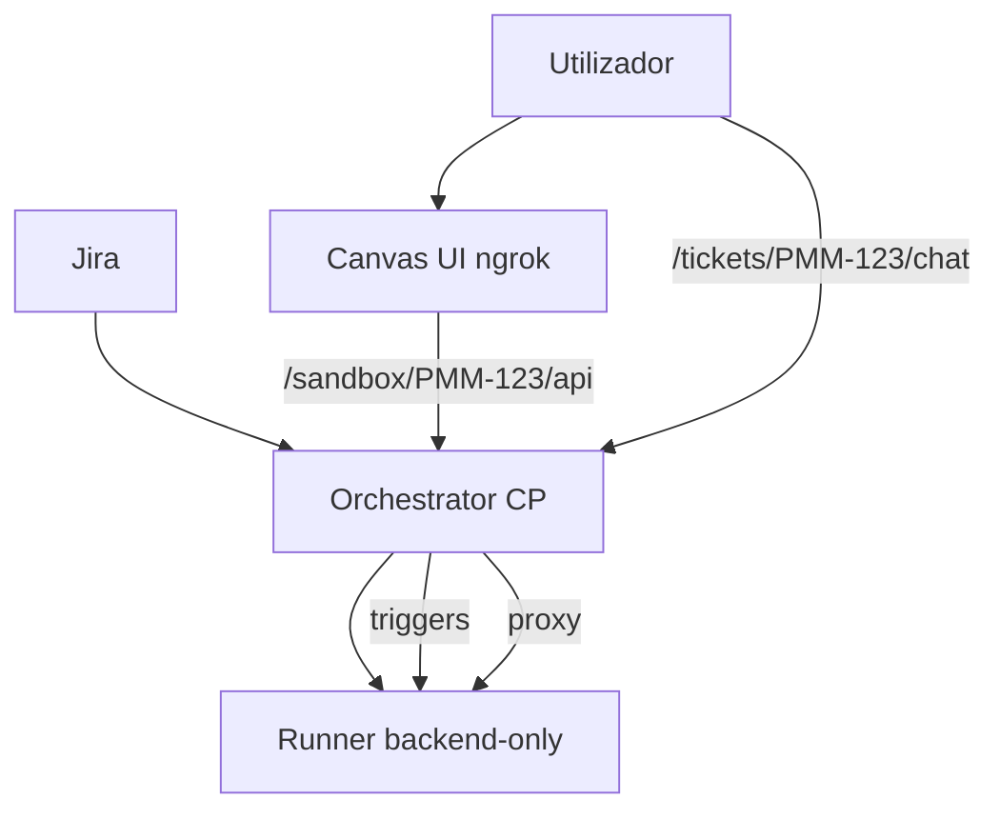

# Arquitetura alvo / Target architecture

Recomendação consolidada para evoluir o POC `pmm-agentic-flow` de **runner-per-chat** para **chat único no control plane** com runners como sandboxes apenas.

Ver também: [pmm-architecture.md](./pmm-architecture.md), [llm-acp.md](./llm-acp.md#architecture-control-plane-vs-runner-chat), [architecture-faq.md](./architecture-faq.md).

---

## Estado actual / Current state (Fase 2 — implementado)

| Componente | Onde corre | Papel |
|------------|------------|-------|
| **Orchestrator** | Control plane `:8080` | Webhook Jira, provisioning Linode, triggers ao agent-server do sandbox |
| **Agent Canvas (UI)** | Control plane `:8000` + ngrok | **UI única** — `https://<ngrok>/` |
| **Sandbox runner** | VM Linode por ticket `:8000` | `agent-canvas --backend-only --public` — agent-server + workspace apenas |
| **Proxy same-origin** | nginx → orchestrator `/sandbox/{TICKET}/` | Browser usa backend remoto sem expor IP do runner |
| **Chat bootstrap** | `/tickets/{TICKET}/chat` | Regista backend no browser e abre conversa na UI principal |
| **ACP** | Control plane apenas | Cursor `agent acp` — runners sem ACP |

```text
Jira → orchestrator
         ├─ Linode API → runner (backend-only)
         ├─ OpenHandsClient → http://<runner-ip>:8000  (triggers /opsx:*, /loop:qa)
         └─ Jira link → https://<ngrok>/tickets/PMM-123/chat → UI principal + proxy /sandbox/PMM-123/
```

Ver [sandbox-lifecycle.md](./sandbox-lifecycle.md).



---

## Fase 1 — Legado (runner_per_chat)

Modo antigo: Canvas completo em cada runner; links Jira apontavam para `http://<runner-ip>:8000`. Substituído por `sandbox.mode: central_ui_remote_sandbox` em `config/stack.yaml`.

---

## Fase 2 — Chat único + runners backend-only (implementado)

**Objectivo:** uma conversa por ticket na **UI principal**; runners = sandboxes de execução (como OpenHands Cloud / Cursor Agents).

**Implementação:**

1. Runners: `agent-canvas --backend-only --public`.
2. Control plane: `agent-canvas --public` (UI via ngrok).
3. Orchestrator: `OpenHandsClient` → runner IP (agent-server); links públicos → `/tickets/{key}/chat`.
4. Registo de backend: página bootstrap + proxy `/sandbox/{ticket}/` (same-origin).
5. ACP só no control plane.

**Limitação conhecida:** backends Canvas continuam em `localStorage` do browser — o bootstrap configura por sessão/dispositivo na primeira visita ao link do ticket. Não há API server-side OpenHands para backends.

---

## Fase 3 — Backend de agente (opcional)

| Opção | Quando escolher | Tradeoffs |
|-------|-----------------|-----------|
| **ACP self-hosted (Cursor/Copilot)** | UI Canvas + subscrições existentes | CDN 403 Linode; Manage Backends manual; `session/request_permission` precisa auto-approve |
| **Cursor Cloud Agents API** | Automação 100% headless (Jira → propose/apply/QA) | Não integra nativamente com Canvas OpenHands; custo API; perde pmm-framework no runner Linode |
| **OpenHands Cloud API** | Sandbox gerido sem Linode runners | Perde controlo PMM (FB images, pmm-framework, firewall); dados fora da Percona |

**Recomendação Fase 3:**

1. **Curto prazo:** ACP Copilot no control plane + orchestrator com cliente ACP que **auto-aprova** permissões.
2. **Médio prazo:** Cursor Cloud Agents API só para fases headless, Canvas para observabilidade humana.
3. **Não migrar** tudo para OpenHands Cloud enquanto pmm-framework + FB + isolamento Percona forem requisitos.

---

## Spikes abertos / Open spikes

| Spike | Pergunta | Impacto |
|-------|----------|---------|
| **Backend API registration** | Existe API para registar runner como backend no Canvas do CP (vs “Manage Backends” manual)? Padrão SDK `Remote Agent Server`? | Bloqueia Fase 2 |
| **ACP auto-approve** | Orchestrator responde `allow` a `session/request_permission` sem humano no chat? | Bloqueia automação autónoma |
| **OpenHands `waiting_for_confirmation`** | Polling + auto-resposta se API suportar? | Loops Dev↔QA autónomos |
| **Canvas settings API** | Automatizar config ACP no cloud-init do CP? | Elimina passo manual pós-deploy |

---

## Objectivo autónomo / Autonomous goal

Fluxo desejado (gates humanos só onde necessário):

```text
Ready for Refinement → /opsx:propose (auto)
Ready for Work       → gate humano PO (manter)
In Progress          → /opsx:apply + build loop (auto)
In Review            → gate humano eng (manter)
In QA                → /loop:qa (auto)
Ready for Merge      → finalize + teardown (auto)
```

O orchestrator **já tem** a máquina de estados certa (`workflow-engine.ts`); falta fiabilidade na camada agente + webhooks + spikes acima.

---

## Comparação rápida / Quick comparison

| | Chat UI | Sandbox / exec | Automação API | Custo POC |
|--|---------|----------------|---------------|-----------|
| **OpenHands Cloud** | UI central SaaS | Sandbox remoto gerido | API cloud | SaaS / limites |
| **POC actual** | UI por runner + CP manual | VM Linode por ticket | Canvas API V1 no runner | Linode pay-as-you-go |
| **Cursor Agents** | cursor.com / IDE | Cloud VM por agent | Cloud Agents API | Subscrição + API |
| **Alvo Fase 2** | UI única no CP (ngrok) | Runner backend-only | Canvas API no CP | Mesmo custo Linode, menos UI duplicada |
