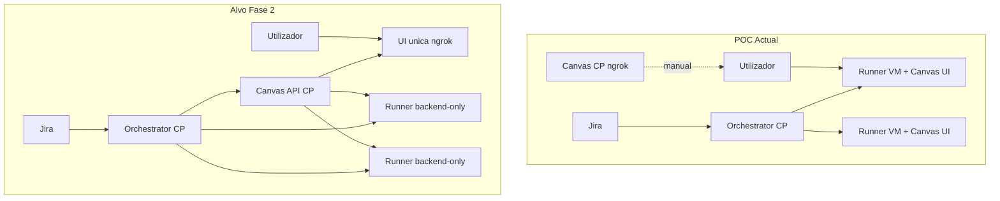

# Arquitetura alvo / Target architecture

Recomendação consolidada para evoluir o POC `pmm-agentic-flow` de **runner-per-chat** para **chat único no control plane** com runners como sandboxes apenas.

Ver também: [pmm-architecture.md](./pmm-architecture.md), [llm-acp.md](./llm-acp.md#architecture-control-plane-vs-runner-chat), [architecture-faq.md](./architecture-faq.md).

---

## Estado actual / Current state (Fase 1)

| Componente | Onde corre | Papel hoje |
|------------|------------|------------|
| **Orchestrator** | Control plane `:8080` | Webhook Jira, provisioning Linode, `dispatchCommand` |
| **Agent Canvas (UI)** | Control plane `:8000` + ngrok | Acesso manual via `https://<ngrok>/` — **não** recebe prompts do workflow |
| **Agent Canvas (workflow)** | Runner VM por ticket `:8000` | `ensureRunner` + `OpenHandsClient` enviam `/opsx:*` e `/loop:qa` |
| **Isolamento** | VM Linode dedicada | Sem Docker; workspace em `/projects/pmm` + `pmm-qa` |
| **ACP** | CP + runners | Cursor `agent acp` ou Copilot `copilot acp` (fallback se CDN 403) |

O código em `orchestrator/src/workflow-engine.ts` despacha explicitamente para o Canvas do **runner**, não do control plane. Isto é intencional no POC actual: isola bem e espelha o que OpenHands Cloud faz “por baixo”, mas duplica UI por ticket.



---

## Fase 1 — Consolidar (agora)

**Manter:**

- Terraform + orchestrator Node + ticket store
- Provisioning Linode por ticket (`LinodeRunnerClient`)
- `OpenHandsClient` com API V1 (`app-conversations`, `send-message`)
- VM como sandbox (sem Docker)
- nginx + ngrok no control plane (webhook Jira estável)
- ACP com Copilot como fallback (CDN 403 em Linode — ver [llm-acp.md](./llm-acp.md))

**Completar gaps:**

- Wire completo Jira webhook → `handleTransition`
- FB resolver + comentários PR automáticos
- `simulate-transition.sh` para testes sem Jira

**Não mudar ainda:** modelo runner-per-chat — funciona e isola bem.

---

## Fase 2 — Chat único + runners backend-only

**Objectivo:** uma conversa por ticket no **control plane**; runners = hosts de execução apenas (como OpenHands Cloud / Cursor Agents).

```text
Jira webhook → orchestrator (control plane :8080)
                    │
                    ├─ Linode API → runner VM (backend-only, :8000)
                    │
                    └─ OpenHandsClient → control plane Canvas (:8000)
                           conversa PMM-12345
                           execução no runner registado como backend
```

**Passos técnicos:**

1. **Runners:** `agent-canvas --backend-only --public` (sem UI no runner).
2. **Control plane:** manter `agent-canvas --public` (UI única via ngrok).
3. **Orchestrator:** `OpenHandsClient` aponta para `http://127.0.0.1:8000` (CP), não para IP do runner.
4. **Registo de backend:** ao provisionar runner, registar automaticamente como backend no Canvas do CP.
5. **Links Jira:** `https://<ngrok>/conversations/{id}` em vez de `http://<runner-ip>:8000`.
6. **Workspace PMM:** `sandbox/setup-pmm-workspace.sh` no runner; expor SSH/VS Code via API sandbox.

**Alternativa frágil:** dispatch HTTP ao runner + espelhar eventos para conversa no CP — evitar se existir API de backends.

OpenHands self-hosted **não tem** hoje equivalente plug-and-play ao `OpenHandsCloudWorkspace`. A Fase 2 inclui um **spike de 1–2 semanas** para validar registo automático de backends.

---

## Fase 3 — Backend de agente (opcional)

| Opção | Quando escolher | Tradeoffs |
|-------|-----------------|-----------|
| **ACP self-hosted (Cursor/Copilot)** | UI Canvas + subscrições existentes | CDN 403 Linode; Manage Backends manual; `session/request_permission` precisa auto-approve |
| **Cursor Cloud Agents API** | Automação 100% headless (Jira → propose/apply/QA) | Não integra nativamente com Canvas OpenHands; custo API; perde pmm-framework no runner Linode |
| **OpenHands Cloud API** | Sandbox gerido sem Linode runners | Perde controlo PMM (FB images, pmm-framework, firewall); dados fora da Percona |

**Recomendação Fase 3:**

1. **Curto prazo:** ACP Copilot no control plane + orchestrator com cliente ACP que **auto-aprova** permissões.
2. **Médio prazo:** Cursor Cloud Agents API só para fases headless, Canvas para observabilidade humana.
3. **Não migrar** tudo para OpenHands Cloud enquanto pmm-framework + FB + isolamento Percona forem requisitos.

---

## Spikes abertos / Open spikes

| Spike | Pergunta | Impacto |
|-------|----------|---------|
| **Backend API registration** | Existe API para registar runner como backend no Canvas do CP (vs “Manage Backends” manual)? Padrão SDK `Remote Agent Server`? | Bloqueia Fase 2 |
| **ACP auto-approve** | Orchestrator responde `allow` a `session/request_permission` sem humano no chat? | Bloqueia automação autónoma |
| **OpenHands `waiting_for_confirmation`** | Polling + auto-resposta se API suportar? | Loops Dev↔QA autónomos |
| **Canvas settings API** | Automatizar config ACP no cloud-init do CP? | Elimina passo manual pós-deploy |

---

## Objectivo autónomo / Autonomous goal

Fluxo desejado (gates humanos só onde necessário):

```text
Ready for Refinement → /opsx:propose (auto)
Ready for Work       → gate humano PO (manter)
In Progress          → /opsx:apply + build loop (auto)
In Review            → gate humano eng (manter)
In QA                → /loop:qa (auto)
Ready for Merge      → finalize + teardown (auto)
```

O orchestrator **já tem** a máquina de estados certa (`workflow-engine.ts`); falta fiabilidade na camada agente + webhooks + spikes acima.

---

## Comparação rápida / Quick comparison

| | Chat UI | Sandbox / exec | Automação API | Custo POC |
|--|---------|----------------|---------------|-----------|
| **OpenHands Cloud** | UI central SaaS | Sandbox remoto gerido | API cloud | SaaS / limites |
| **POC actual** | UI por runner + CP manual | VM Linode por ticket | Canvas API V1 no runner | Linode pay-as-you-go |
| **Cursor Agents** | cursor.com / IDE | Cloud VM por agent | Cloud Agents API | Subscrição + API |
| **Alvo Fase 2** | UI única no CP (ngrok) | Runner backend-only | Canvas API no CP | Mesmo custo Linode, menos UI duplicada |
